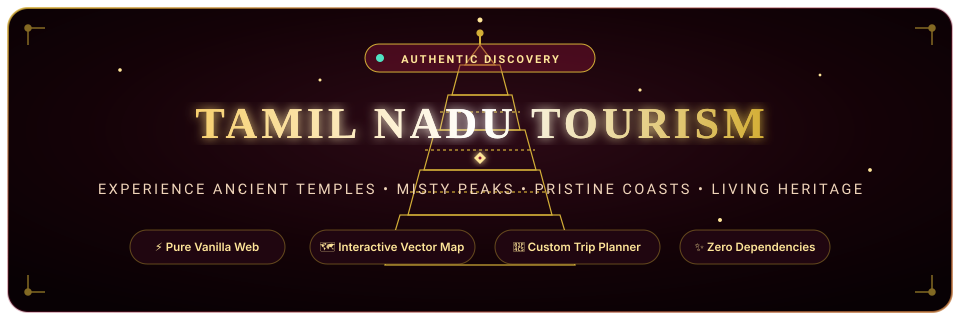
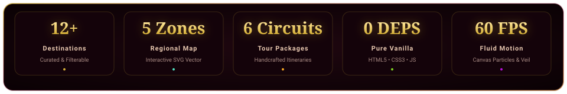
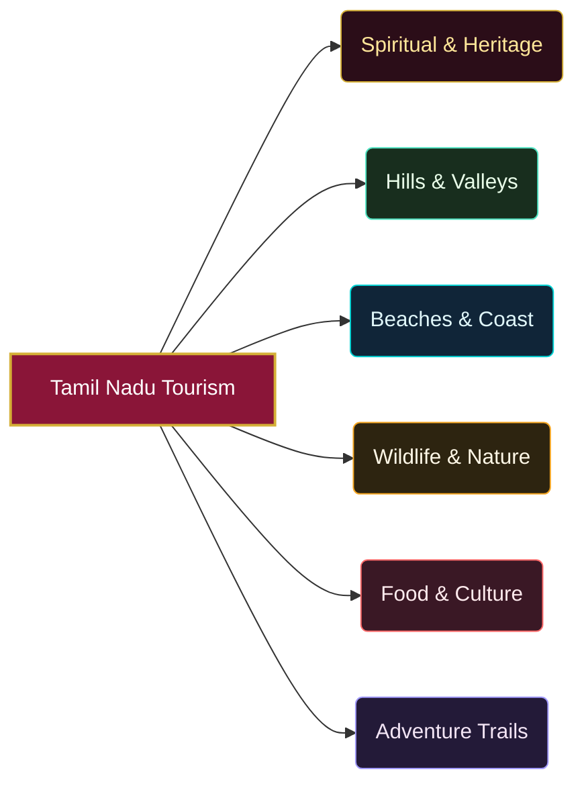

<div align="center">

  <!-- Animated Header Banner -->
  <a href="https://gnanendra942.github.io/TAMILNADU-TOURISM-/">
    
  </a>

  <br/><br/>

  <!-- Dynamic Typing Tagline SVG -->
  <a href="https://gnanendra942.github.io/TAMILNADU-TOURISM-/">
    
  </a>

  <br/>

  <!-- High-Impact Animated Badge Cluster -->
  <p align="center">
    <a href="https://gnanendra942.github.io/TAMILNADU-TOURISM-/">
      
    </a>
    <a href="https://github.com/Gnanendra942/TAMILNADU-TOURISM-/actions/workflows/deploy.yml">
      
    </a>
    <a href="#-technical-architecture">
      
    </a>
    <a href="#-editorial-design-system">
      
    </a>
    <a href="https://github.com/Gnanendra942/TAMILNADU-TOURISM-/blob/main/LICENSE">
      
    </a>
  </p>

  <p align="center">
    
    
    
    
    
    
  </p>

  <!-- Interactive Pill Navigation Menu -->
  <p align="center">
    <a href="#-overview"><b>🌟 Overview</b></a> •
    <a href="#-live-interactive-preview"><b>🖥️ Live Preview</b></a> •
    <a href="#-at-a-glance-metrics"><b>📊 Metrics</b></a> •
    <a href="#-key-features"><b>✨ Features</b></a> •
    <a href="#-interactive-regional-vector-map"><b>🗺️ Regional Map</b></a> •
    <a href="#-algorithmic-smart-trip-planner"><b>📅 Trip Planner</b></a> •
    <a href="#-curated-tour-circuits"><b>🎒 Tour Circuits</b></a> •
    <a href="#-quick-start"><b>⚡ Quick Start</b></a>
  </p>

</div>


## 📖 Overview

**Tamil Nadu Tourism** is an editorial-grade, high-performance travel discovery platform crafted to showcase the monumental heritage, ecological diversity, and cultural heartbeat of Southern India.

Rooted in traditional South Indian temple aesthetics, silk textiles, and coastal vibrancy, the web application delivers a rich, desktop-and-mobile native feel with **zero external dependencies, zero libraries, and zero build toolchains**. 

From the world-renowned Chola architectural marvels and UNESCO Nilgiri Mountain Railway to the tranquil backwaters of Pichavaram and sacred confluences at Kanyakumari, every detail is engineered with fluid micro-interactions, responsive vector graphics, and intelligent client-side computation.

> [!TIP]
> **Experience it live in your browser**: Jump straight into the interactive discovery platform at **[gnanendra942.github.io/TAMILNADU-TOURISM-](https://gnanendra942.github.io/TAMILNADU-TOURISM-/)**.


## 🖥️ Live Interactive Preview

<div align="center">
  <a href="https://gnanendra942.github.io/TAMILNADU-TOURISM-/">
    
  </a>
  <p><i>💡 Real-time predictive search, dynamic destination carousel, vector geographic mapping & smart itinerary planner</i></p>
</div>


## 📊 At A Glance Metrics

<div align="center">
  
</div>

<br/>

| Parameter | Specification | Highlights |
| :--- | :--- | :--- |
| **Technology Stack** | Pure Vanilla Web | HTML5, Modern CSS3 Custom Properties, Vanilla ES6+ JavaScript |
| **External Dependencies** | **0 (Zero)** | No React, Vue, jQuery, Tailwind, or NPM bundle overhead |
| **Assets & Imagery** | High-Res Creative Commons | Real licensed photography served dynamically via Wikimedia Commons |
| **Rendering Performance** | **60 FPS** | GPU-accelerated transforms, `requestAnimationFrame`, hardware compositing |
| **SEO & Accessibility** | Semantic HTML5 | Screen-reader accessible attributes, ARIA roles, `prefers-reduced-motion` |
| **Deployment Mode** | Continuous Delivery | Automated GitHub Actions workflow targeting GitHub Pages |


## ✨ Key Features

### 🔍 1. Smart Predictive Search with Out-of-State Detection
- **Instant Client-Side Autocomplete**: Matches against destination names, districts, geographic regions, and categories.
- **Dynamic `<mark>` Highlighting**: Instantly wraps matching sub-strings in distinctive illuminated highlights.
- **Keyboard Navigation**: Native ergonomics with `Arrow Up`, `Arrow Down`, `Enter` to select, and `Escape` to close.
- **Intelligent Out-of-State Heuristic**: Entering non-Tamil Nadu queries (e.g. *Goa, Munnar, Kerala, Bangalore, Jaipur*) triggers helpful contextual suggestions pointing to equivalent Tamil Nadu wonders.
- **Popular Recommendation Chips**: Quick-tap chips when the search bar gains focus.

---

### 🏛️ 2. Curated Destinations Carousel & Fullscreen Slide Modal
- **Horizontal Scroll Snap**: Smooth, kinetic carousel featuring iconic locations.
- **Interactive Visual Cards**: Hover-triggered gradient border beams, image floating motion, and badge tags.
- **Comprehensive Detail View Modal**:
  - High-resolution hero imagery with backdrop blur
  - Historical background, cultural significance, and best visiting seasons
  - Tagged highlights & nearby excursion hotspots
  - Curated photo gallery with multi-angle views
  - One-click trigger linking directly into the Custom Trip Planner

---

### 🧭 3. Six Curated Experience Clusters



1. **Spiritual & Heritage**: Living Chola architectural wonders, Madurai's towering gopurams, and coastal stone carvings.
2. **Hills & Valleys**: The misty, tea-carpeted elevations of Ooty, Kodaikanal, Yercaud, and Valparai.
3. **Beaches & Coast**: From Marina Beach to the dramatic three-ocean confluence at Kanyakumari.
4. **Wildlife & Nature**: Anamalai tiger corridors, sacred waterfalls at Courtallam, and Pichavaram mangroves.
5. **Food & Culture**: Chettinad culinary art, Classical Bharatanatyam, and Carnatic music festivals.
6. **Adventure**: Western Ghats trekking, toy mountain railways, and coastal watersports.

---

### 🗺️ 4. Interactive Regional Vector Map

An interactive SVG representation of Tamil Nadu broken down into five distinct cultural and geographic zones:

<details open>
<summary><b>📍 Explore the 5 Distinct Geographic Zones (Click to expand)</b></summary>
<br/>

| Geographic Zone | Key Cities & Districts | Regional Highlights |
| :--- | :--- | :--- |
| **North** | Chennai, Mahabalipuram, Kanchipuram, Vellore, Tiruvallur | Shore Temple, Silk Weaving, Pallava Sculptures, Marina Beach |
| **South** | Madurai, Rameswaram, Kanyakumari, Tirunelveli, Tenkasi | Meenakshi Amman Temple, Pamban Bridge, Triveni Sangam, Waterfalls |
| **Central** | Trichy, Karur, Perambalur, Pudukkottai | Rockfort Temple, Kaveri River Basin, Chettinad Palaces |
| **West** | Coimbatore, Ooty, Salem, Erode, Valparai, Yercaud | Nilgiri UNESCO Railway, Anamalai Tiger Reserve, Coffee Hills |
| **Delta** | Thanjavur, Kumbakonam, Nagapattinam, Mayiladuthurai | Great Living Chola Temples, Saraswathi Mahal, Sacred Cauvery Delta |

</details>

---

### 📅 5. Algorithmic Smart Trip Planner

Generate customized, realistic itineraries matching travelers' exact preferences:
- **Duration**: 3 Days (Weekend Sprint), 5 Days (Classic Tour), 7 Days (Deep Dive), 10 Days (Grand Circuit)
- **Pace Calibration**: Relaxed, Balanced, or High-Intensity Explorer
- **Budget Tiering**: Comfort, Premium, or Royal Heritage
- **Interest Filter Vector**: Temples, Nature, Food, Beaches, Adventure, Photography, Culture
- **Dynamic Matching Engine**: Real-time scoring calculates the optimal route, balancing travel times and landmark density.

---

### 🎒 6. Handcrafted Tour Circuits

<div align="center">

| Circuit Package | Duration | Dests | Highlights |
| :--- | :---: | :---: | :--- |
| 🛕 **Temple Trails of the South** | 6 Days | 4 | Madurai, Rameswaram, Thanjavur, and Kanchipuram |
| 🚂 **Nilgiri Escape** | 4 Days | 3 | Ooty, Coonoor, Kotagiri, and UNESCO Toy Train |
| 🌊 **Coastal Honeymoon** | 5 Days | 3 | Mahabalipuram shores, French colonies, and Kanyakumari |
| 🐅 **Western Ghats Wild** | 5 Days | 3 | Valparai rainforests and Anamalai Tiger Reserve |
| 👑 **Family Heritage Circuit** | 7 Days | 5 | Chennai, Mamallapuram, Thanjavur, Madurai, and Dhanushkodi |
| ☕ **Weekend in the Hills** | 3 Days | 2 | Refreshing retreat across Yercaud lakes & Shevaroy peaks |

</div>

---

### ⚡ 7. Ambient Theme Engine & Micro-Interactions
- **Interactive Constellation Canvas**: Background particle constellation dynamically follows and reacts to cursor physics.
- **Dynamic Ambient Palette**: Smooth CSS transitions between deep temple maroon (`#8a1538`), terracotta (`#c17a3d`), and warm gold (`#d4a24a`).
- **Smooth Page Veil Transitions**: Polished full-screen veil wipes when jumping across section anchors.
- **Hero Ken Burns Slideshow**: High-resolution photography slowly glides with subtle scale transforms.
- **Reduced Motion Compliant**: Automatically detects and respects OS accessibility configurations (`prefers-reduced-motion`).


## 🎨 Editorial Design System

```
  Primary Maroon       Terracotta Warmth      Warm Temple Gold       Emerald Pine         Coastal Cyan
     #8A1538                #C17A3D                #D4AF37              #2D5E3F              #1B4D66
  ┌────────────┐         ┌────────────┐         ┌────────────┐       ┌────────────┐       ┌────────────┐
  │   Temple   │         │ Earthware  │         │ Auspicious │       │  Nilgiri   │       │  Coromandel│
  │ Gopuram &  │         │ & Classic  │         │ Brassware  │       │  Rainforest│       │  Ocean     │
  │ Silk Color │         │ Terracotta │         │ & Silk     │       │  & Spices  │       │  Waves     │
  └────────────┘         └────────────┘         └────────────┘       └────────────┘       └────────────┘
```

- **Headings & Editorial Display**: [`Fraunces`](https://fonts.google.com/specimen/Fraunces) — An expressive serif inspired by 20th-century vintage typefaces.
- **Interface & Readability**: [`Manrope`](https://fonts.google.com/specimen/Manrope) — A clean geometric modern sans-serif.
- **Surface Elevation**: Glassmorphism with `backdrop-filter: blur(18px)`, translucent rgba containers, and glowing golden hairline borders.
- **Motion Curves**: Custom `cubic-bezier(.22, 1, .36, 1)` spring-like deceleration for a tactile feel.


## 🏛️ Featured Destinations Showcase

<details open>
<summary><b>🌍 Click to view the 12 Flagship Destinations cataloged in the application</b></summary>
<br/>

| Destination | District | Region | Category | Signature Highlights |
| :--- | :--- | :--- | :--- | :--- |
| **Madurai** | Madurai | South | Spiritual & Heritage | Meenakshi Amman Temple, Thirumalai Nayakkar Palace, Teppakulam |
| **Ooty** | Nilgiris | West | Hill Station | Nilgiri Mountain Railway (UNESCO), Doddabetta Peak, Tea Gardens |
| **Kodaikanal** | Dindigul | West | Hill Station | Star-shaped Kodai Lake, Pillar Rocks, Coaker's Walk, Pine Forests |
| **Chennai** | Chennai | North | Beaches & Coast | Marina Beach, Kapaleeshwarar Temple, Fort St. George, San Thome |
| **Kanyakumari** | Kanyakumari | South | Beaches & Coast | Vivekananda Rock Memorial, 133-ft Thiruvalluvar Statue, Triveni Sangam |
| **Rameswaram** | Ramanathapuram | South | Spiritual & Heritage | Ramanathaswamy 1,200 Pillar Corridor, Pamban Rail Bridge, Dhanushkodi |
| **Thanjavur** | Thanjavur | Delta | Spiritual & Heritage | Brihadeeswarar Temple (UNESCO Chola), Saraswathi Mahal Library |
| **Mahabalipuram** | Chengalpattu | North | Spiritual & Heritage | 7th-century Shore Temple, Pancha Rathas, Arjuna's Penance Bas-Relief |
| **Yercaud** | Salem | West | Hill Station | Shevaroy Hills, Emerald Lake, Killiyur Falls, Coffee Plantations |
| **Valparai** | Coimbatore | West | Wildlife & Nature | Anamalai Tiger Reserve, Sholayar Dam, Wild Rainforest Plateaus |
| **Coimbatore** | Coimbatore | West | Food & Culture | Marudamalai Hill Temple, Perur Pateeswarar Temple, Western Ghats Gate |
| **Courtallam** | Tenkasi | South | Wildlife & Nature | "Spa of South India", Main Falls, Five Falls, Herbal Cascade Waters |

</details>


## 🗂️ Clean Architecture

The entire project is packaged as a high-performance single-page application with clean separation of structural layers, zero dependencies, and instant local execution:

```
TAMILNADU-TOURISM-/
├── 📁 .github/
│   └── 📁 workflows/
│       └── 📄 deploy.yml           # Automated CI/CD GitHub Pages deployment
├── 📁 assets/
│   ├── 🎨 banner.svg               # Animated vector hero banner with glowing gopuram
│   ├── ⚡ divider.svg              # Animated pulsing section divider line
│   ├── 📊 stats-card.svg           # Animated metrics & project statistics widget
│   ├── 🖥️ app-preview.svg          # Responsive glassmorphic UI browser mockup
│   └── 🌊 footer.svg               # Animated closing wave footer
├── 📄 .nojekyll                    # Disables Jekyll processing for raw static file hosting
├── 📄 index.html                   # Primary production document (Structure, CSS & JS)
├── 📄 tamil-nadu-tourism (3) (1).html # Standalone single-page backup
└── 📄 README.md                    # Project documentation & visual presentation
```


## ⚡ Quick Start

You can launch the web application immediately without running `npm install`, downloading packages, or executing complex build commands.

### Option 1: Direct Browser Launch
Simply double-click `index.html` or run in your terminal:

```bash
# macOS
open index.html

# Linux
xdg-open index.html

# Windows
start index.html
```

---

### Option 2: Run with Local HTTP Server

Running with a lightweight local web server ensures full support for origin security policies and smooth asset loading:

**Using Python 3**:
```bash
python3 -m http.server 8000
```
*Open your browser and navigate to: [`http://localhost:8000`](http://localhost:8000)*

**Using Node.js (`npx serve`)**:
```bash
npx -y serve .
```

**Using VS Code Live Server**:
Right-click `index.html` in VS Code and select **"Open with Live Server"**.

---

### Option 3: Continuous Deployment with GitHub Pages

The repository includes a GitHub Actions workflow (`.github/workflows/deploy.yml`) pre-configured for automated continuous deployment:

1. Push any updates to the `main` branch.
2. Under your repository's **Settings** > **Pages**, set **Source** to **GitHub Actions**.
3. GitHub Actions will build and deploy the application live to `https://<your-username>.github.io/<repo-name>/`.


## 📱 Browser Compatibility

The application is thoroughly verified across all modern web browsers:

| Browser | Supported Version | Hardware Acceleration |
| :--- | :---: | :---: |
| **Google Chrome** | 88+ | ✅ Supported |
| **Apple Safari** (macOS & iOS) | 14+ | ✅ Supported |
| **Mozilla Firefox** | 85+ | ✅ Supported |
| **Microsoft Edge** | 88+ | ✅ Supported |
| **Android Chrome / Samsung Internet** | Latest | ✅ Supported |


## 📜 Heritage & Acknowledgements

- **Visual Assets & Photography**: Authentic, licensed photography from [Wikimedia Commons](https://commons.wikimedia.org/) under Creative Commons Attribution-ShareAlike licenses.
- **Typography**: [Fraunces](https://fonts.google.com/specimen/Fraunces) & [Manrope](https://fonts.google.com/specimen/Manrope) provided by [Google Fonts](https://fonts.google.com/).
- **Inspiration**: The living culture, temples, artisans, and landscapes preserved by the people of Tamil Nadu and the **Tamil Nadu Tourism Development Corporation (TTDC)**.


<!-- Animated Footer Banner -->
<div align="center">
  <a href="https://gnanendra942.github.io/TAMILNADU-TOURISM-/">
    
  </a>
</div>

<div align="center">
  <br/>
  <sub>Made with ❤️ for Tamil Nadu • Star ⭐ this repository if you find it inspiring!</sub>
</div>